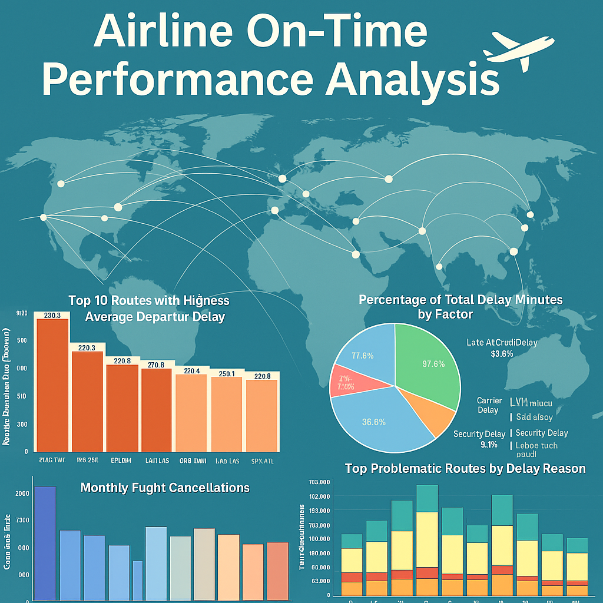

# Airline On-Time Performance Analysis — 2004 Data

This project analyzes the patterns and causes of flight delays and cancellations in U.S. domestic airlines.The main goal is to help airlines and airports understand when and why disruptions happen,and to suggest ways to improve on-time performance.

## Source

- **Dataset:** "Airline On-Time Performance" dataset from Kaggle: https://tinyurl.com/u8rzvdsx

## Author

- **Name:** WANG RONGCHENG  
- **Email:** P150280@siswa.ukm.edu.my

## Project Overview

- The analysis uses flight data from the year 2004.
- The dataset covers various airlines,airports,flight routes,and cancellation reasons.
- The project examines how delays and cancellations change by time of day,day of week,month,season,route,and carrier.
- It identifies major factors that contribute to delays and cancellations.

## Key Features

- **Data Exploration:** Summarizes the main features of the dataset.
- **Delay Patterns:** Analyzes average departure delays by time of day,day of week,month,and season.
- **Delay Factors:** Investigates the leading causes of flight delays using detailed delay categories.
- **Cancellation Analysis:** Explores cancellation reasons,airline-specific trends,and airport impacts.
- **Problematic Routes:** Identifies the most delayed and cancelled routes,and explores the main causes for each.
- **Visualization:** Includes clear bar charts,pie charts,and line plots to present findings.

## Tools & Libraries

This project uses the following main tools and libraries:

- **Python 3**
- **Pandas**: For data manipulation and analysis
- **NumPy**: For numerical operations
- **Matplotlib**: For data visualization
- **Seaborn**: For advanced data visualization
- **Jupyter Notebook**: For running and documenting the analysis
- **SQLite3**: For SQL queries on large datasets

## Main Insights

- Delays are more likely in the evening and during winter or peak travel seasons.
- Mondays and major holidays often see more delays and cancellations.
- Most delays are due to late aircraft,carrier-related issues,or airspace congestion.
- Weather and security cause fewer disruptions overall,but can have major local impacts.
- Certain routes and airlines experience much higher delay and cancellation rates than others.

## Recommendations

- Airlines should focus resources on high-risk routes and times.
- Extra buffer time in scheduling and better coordination can help reduce delays.
- Improved communication with passengers can reduce frustration during disruptions.
- Airports and airlines should prepare for seasonal peaks with flexible staffing and clear contingency plans.

